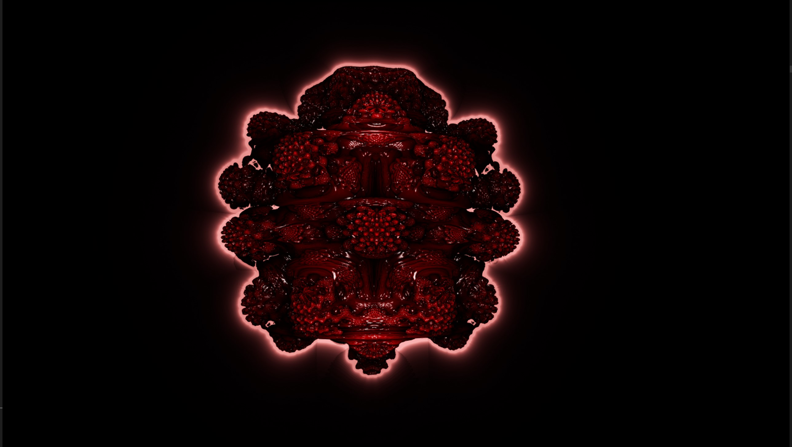
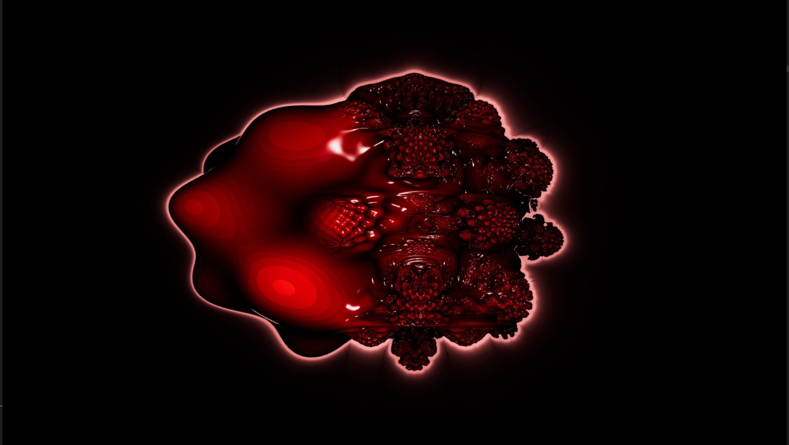
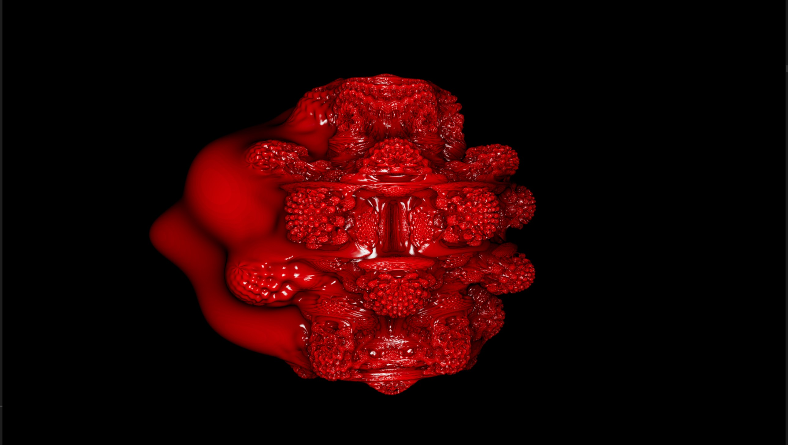
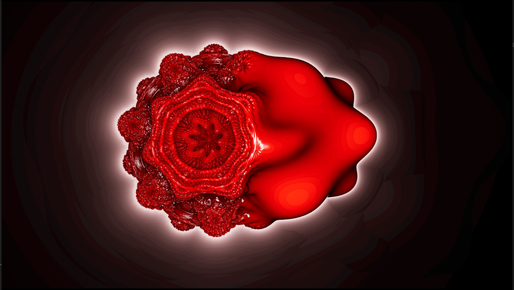
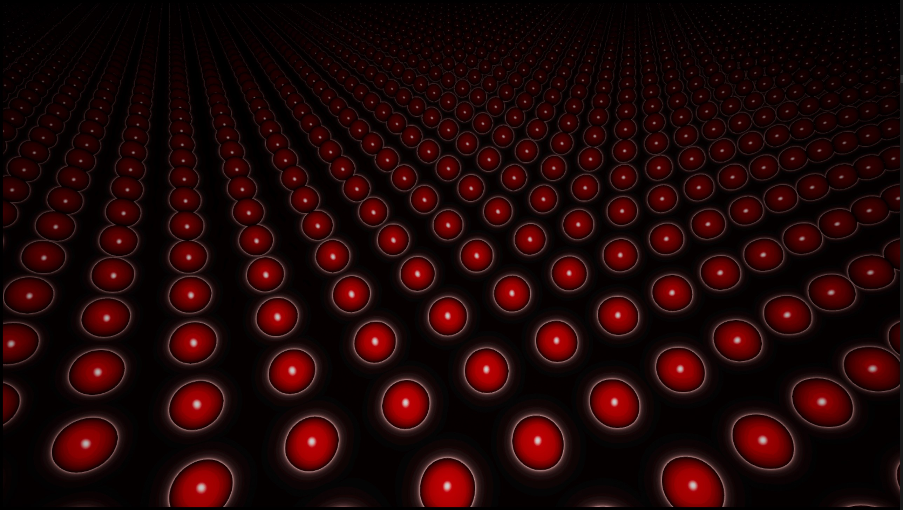

# RayMarching
Ray marching algorithm implemented using compute shaders in Unreal Engine. 

The implemented algorithm allows visualization of objects based on their signed distance function (SDF) and also includes various additional effects possible in ray marching:

- objects repetition,
- fog,
- ambient occlusion,
- glow,
- smooth blend between objects.

The project contains an Unreal Engine plugin with a custom compute shader.
 

## How to use
To run this plugin, copy the RayMarchingShaders folder and its contents to the Plugins folder in your Unreal Engine project. Function ExecuteRayMarchingComputeShader available in Blueprints allows for rendering view to the RenderTarget provided.

## Renders

